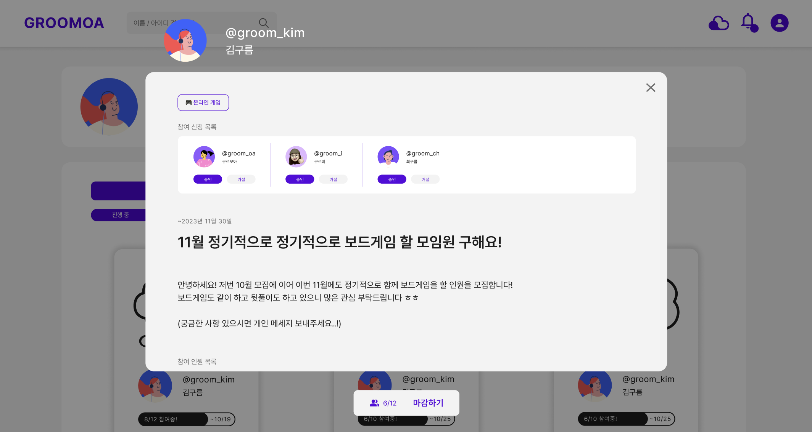

# 구르모아 

해당 레포지토리는 "구르모아"의 백엔드 레포지토리입니다.  
[`프론트엔드 레포지토리`](https://github.com/goormthon-Univ/TEAM_10.git)  

> ### Description
구르모아는 “조금이라도 아는 사람을 대상으로 신뢰성이 있는 인원 모집을 할 수는 없을까?” 라는 고민에서 기획한 서비스로
대부분 불특정 다수를 매칭하는 현재 매칭 서비스와는 달리, 가입자 간 공통 관심사 및 공통 팔로워 등을 고려하여 사용자를 추천합니다. 
모든 사용자는 모임을 개설할 수 있고, 개설된 모임의 채팅 페이지에서 멤버들과 소통할 수 있습니다.    

> ### Tech Stack 🛠

- Laungages : 
- Tools : 
- [`구르모아 Notion`](https://www.notion.so/10-f9c9de22b0964d2ebf2cb0f8922cd413)   

> ### Result (2023.11.18)

 
  
모임 모집 페이지(참여자용)

  
  
모임 모집 페이지(모임 주최자용)

  
  
개설된 모임 채팅 페이지

  
  
메인페이지

  
  
마이페이지

  

